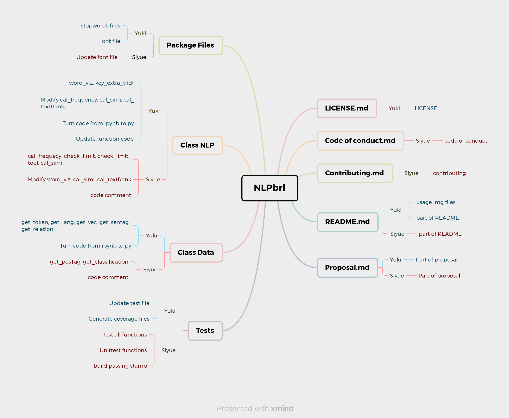

# Contributing

**Yuki**|**Siyue**
---|---
proposal|proposal
get_token|cal_frequency
get_lang|check_limit
get_vec|check_limit_tool
stopwords file|modify word_viz
word_viz|font file update
font file|test word_viz, cal_frequency
key_extra_tfidf|cal_simi
modify cal_frequency,cal_simi|modify cal_simi
get_sentag|test cal_simi
cal_textRank|get_postag
get_relation|modify cal_textRank
turn code from ipynb to py|test get_posTag
functioin code update|get_classification
package_data update|test get_relation, get_classification
update test_all file|test all functions
run Unittest and generate coverage files|unittest functions
LICENSE.md file|add code comment
file organization|README.md
README.md|build passing stamp
code update|Contributing.md
usage imgs|Code of conduct

             
